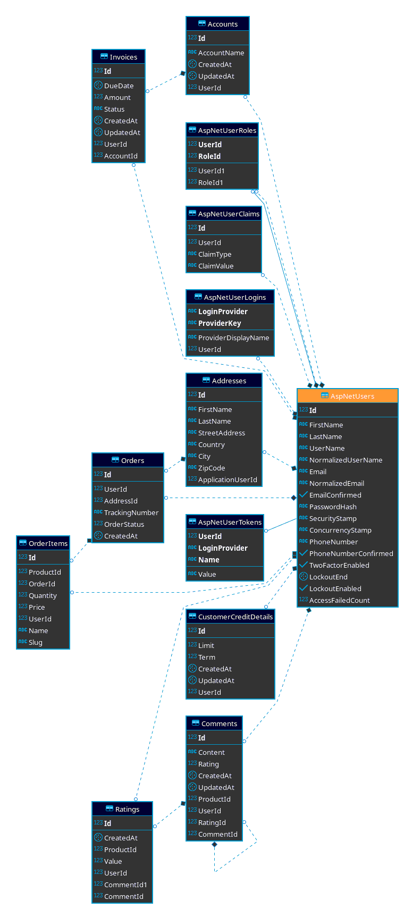
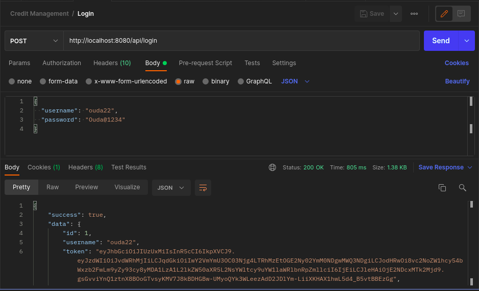

<h1>Credit Management Rest API</h1>
 

 
Rest API for Credit Management
 

<h2>Project Structure</h2>
<pre style="text-align: left">
.
├── CreditManagementTest
│   ├── appsettings.Development.json
│   ├── appsettings.json
│   ├── bin
│   │   └── Debug
│   │       └── net5.0
│   │           ├── appsettings.Development.json
│   │           ├── appsettings.json
│   │           ├── AspNetCore.RouteAnalyzer.dll
│   │           ├── Bogus.dll
│   │           ├── CreditManagementTest
│   │           ├── CreditManagementTest.deps.json
│   │           ├── CreditManagementTest.dll
│   │           ├── CreditManagementTest.pdb
│   │           ├── CreditManagementTest.runtimeconfig.dev.json
│   │           ├── CreditManagementTest.runtimeconfig.json
│   │           ├── CreditManagementTest.StaticWebAssets.xml
│   │           ├── EntityFramework.dll
│   │           ├── Humanizer.dll
│   │           ├── Microsoft.AspNetCore.Authentication.JwtBearer.dll
│   │           ├── Microsoft.AspNetCore.Diagnostics.EntityFrameworkCore.dll
│   │           ├── Microsoft.AspNetCore.Identity.EntityFrameworkCore.dll
│   │           ├── Microsoft.AspNetCore.JsonPatch.dll
│   │           ├── Microsoft.AspNetCore.Mvc.Razor.Extensions.dll
│   │           ├── Microsoft.AspNetCore.Razor.Language.dll
│   │           ├── Microsoft.AspNetCore.Server.Kestrel.Https.dll
│   │           ├── Microsoft.AspNetCore.Server.Kestrel.Transport.Abstractions.dll
│   │           ├── Microsoft.AspNetCore.Server.Kestrel.Transport.Libuv.dll
│   │           ├── Microsoft.CodeAnalysis.CSharp.dll
│   │           ├── Microsoft.CodeAnalysis.dll
│   │           ├── Microsoft.CodeAnalysis.Razor.dll
│   │           ├── Microsoft.Data.SqlClient.dll
│   │           ├── Microsoft.DotNet.PlatformAbstractions.dll
│   │           ├── Microsoft.EntityFrameworkCore.Abstractions.dll
│   │           ├── Microsoft.EntityFrameworkCore.Design.dll
│   │           ├── Microsoft.EntityFrameworkCore.dll
│   │           ├── Microsoft.EntityFrameworkCore.Relational.dll
│   │           ├── Microsoft.EntityFrameworkCore.SqlServer.dll
│   │           ├── Microsoft.Extensions.DependencyModel.dll
│   │           ├── Microsoft.Identity.Client.dll
│   │           ├── Microsoft.IdentityModel.JsonWebTokens.dll
│   │           ├── Microsoft.IdentityModel.Logging.dll
│   │           ├── Microsoft.IdentityModel.Protocols.dll
│   │           ├── Microsoft.IdentityModel.Protocols.OpenIdConnect.dll
│   │           ├── Microsoft.IdentityModel.Tokens.dll
│   │           ├── Microsoft.OpenApi.dll
│   │           ├── Newtonsoft.Json.Bson.dll
│   │           ├── Newtonsoft.Json.dll
│   │           ├── Npgsql.dll
│   │           ├── Npgsql.EntityFrameworkCore.PostgreSQL.dll
│   │           ├── ref
│   │           │   └── CreditManagementTest.dll
│   │           ├── runtimes
│   │           │   ├── linux-arm
│   │           │   │   └── native
│   │           │   │       └── libuv.so
│   │           │   ├── linux-arm64
│   │           │   │   └── native
│   │           │   │       └── libuv.so
│   │           │   ├── linux-armel
│   │           │   │   └── native
│   │           │   │       └── libuv.so
│   │           │   ├── linux-x64
│   │           │   │   └── native
│   │           │   │       └── libuv.so
│   │           │   ├── osx
│   │           │   │   └── native
│   │           │   │       └── libuv.dylib
│   │           │   ├── unix
│   │           │   │   └── lib
│   │           │   │       ├── netcoreapp2.0
│   │           │   │       │   └── System.Runtime.Caching.dll
│   │           │   │       └── netcoreapp2.1
│   │           │   │           └── Microsoft.Data.SqlClient.dll
│   │           │   ├── win
│   │           │   │   └── lib
│   │           │   │       ├── netcoreapp2.0
│   │           │   │       │   └── System.Runtime.Caching.dll
│   │           │   │       ├── netcoreapp2.1
│   │           │   │       │   └── Microsoft.Data.SqlClient.dll
│   │           │   │       └── netstandard2.0
│   │           │   │           └── System.Security.Cryptography.ProtectedData.dll
│   │           │   ├── win-arm
│   │           │   │   └── native
│   │           │   │       └── libuv.dll
│   │           │   ├── win-arm64
│   │           │   │   └── native
│   │           │   │       └── sni.dll
│   │           │   ├── win-x64
│   │           │   │   └── native
│   │           │   │       ├── libuv.dll
│   │           │   │       └── sni.dll
│   │           │   └── win-x86
│   │           │       └── native
│   │           │           ├── libuv.dll
│   │           │           └── sni.dll
│   │           ├── Swashbuckle.AspNetCore.Swagger.dll
│   │           ├── Swashbuckle.AspNetCore.SwaggerGen.dll
│   │           ├── Swashbuckle.AspNetCore.SwaggerUI.dll
│   │           ├── System.Configuration.ConfigurationManager.dll
│   │           ├── System.IdentityModel.Tokens.Jwt.dll
│   │           ├── System.Runtime.Caching.dll
│   │           └── System.Security.Cryptography.ProtectedData.dll
│   ├── Controllers
│   │   ├── AccountController.cs
│   │   ├── AddressesController.cs
│   │   ├── AuthController.cs
│   │   ├── CommentsController.cs
│   │   ├── CustomerCreditDetailContoller.cs
│   │   ├── HomeController.cs
│   │   ├── InvoiceController.cs
│   │   ├── OrdersController.cs
│   │   ├── ProductController.cs
│   │   └── TagAndCategoryController.cs
│   ├── CreditManagementTest.csproj
│   ├── Data
│   │   └── ApplicationDbContext.cs
│   ├── Dtos
│   │   ├── Requests
│   │   │   ├── Account
│   │   │   │   └── CreateOrEditAccountDto.cs
│   │   │   ├── Addresses
│   │   │   │   └── CreateOrEditAddressDto.cs
│   │   │   ├── Comments
│   │   │   │   └── CreateOrEditCommentDto.cs
│   │   │   ├── CreditDetail
│   │   │   │   └── CreateOrEditCreditDetailDto.cs
│   │   │   ├── Invoice
│   │   │   │   └── CreateOrEditInvoiceDto.cs
│   │   │   ├── Orders
│   │   │   │   └── CreateOrEditProduct.cs
│   │   │   └── Users
│   │   │       ├── LoginDtoRequest.cs
│   │   │       └── RegisterUserDto.cs
│   │   └── Responses
│   │       ├── Account
│   │       │   ├── AccountDetailsDto.cs
│   │       │   ├── AccountElementalDto.cs
│   │       │   └── AccountListDto.cs
│   │       ├── Addresses
│   │       │   ├── AddressDto.cs
│   │       │   └── AddressesListDtoResponse.cs
│   │       ├── Category
│   │       │   ├── CategoryDto.cs
│   │       │   ├── CategoryListDtoResponse.cs
│   │       │   └── CategoryOnlyNameDto.cs
│   │       ├── Comments
│   │       │   ├── CommentBasicInfoDto.cs
│   │       │   ├── CommentDetailsDto.cs
│   │       │   ├── CommentListDto.cs
│   │       │   └── CreateCommentDto.cs
│   │       ├── CustomerCreditDetail
│   │       │   ├── CreateCustomerCreditDetailDto.cs
│   │       │   └── CustomerDetailDto.cs
│   │       ├── Invoice
│   │       │   ├── InvoiceDetailsDto.cs
│   │       │   └── InvoiceListDto.cs
│   │       ├── OrderItems
│   │       │   └── OrderItemDto.cs
│   │       ├── Orders
│   │       │   ├── OrderDetailsDto.cs
│   │       │   ├── OrderDto.cs
│   │       │   └── OrderListDtoResponse.cs
│   │       ├── Pages
│   │       │   └── HomeResponse.cs
│   │       ├── ProductDetailsDto.cs
│   │       ├── Products
│   │       │   ├── CreateOrEditProduct.cs
│   │       │   ├── ProductElementalDto.cs
│   │       │   ├── ProductListDtoResponse.cs
│   │       │   └── ProductSummaryDto.cs
│   │       ├── ProductsListDto.cs
│   │       ├── Shared
│   │       │   ├── AppResponse.cs
│   │       │   ├── ErrorDtoResponse.cs
│   │       │   ├── PagedDto.cs
│   │       │   └── SuccessResponse.cs
│   │       ├── Tag
│   │       │   ├── TagDto.cs
│   │       │   ├── TagListDtoResponse.cs
│   │       │   └── TagOnlyNameDto.cs
│   │       └── User
│   │           ├── ChangePasswordViewModel.cs
│   │           ├── CreateOrEditUsertViewModel.cs
│   │           ├── UserBasicEmbeddedInfoDto.cs
│   │           ├── UserSummaryViewModel.cs
│   │           └── UserViewModel.cs
│   ├── Entities
│   │   ├── Account.cs
│   │   ├── Address.cs
│   │   ├── ApplicationRole.cs
│   │   ├── ApplicationUser.cs
│   │   ├── AppUserRole.cs
│   │   ├── Category.cs
│   │   ├── CategoryImage.cs
│   │   ├── Comment.cs
│   │   ├── CustomerCreditDetail.cs
│   │   ├── FileUpload.cs
│   │   ├── Invoice.cs
│   │   ├── Order.cs
│   │   ├── OrderInfo.cs
│   │   ├── OrderItem.cs
│   │   ├── ProductCategory.cs
│   │   ├── Product.cs
│   │   ├── ProductImage.cs
│   │   ├── ProductTag.cs
│   │   ├── Rating.cs
│   │   ├── Tag.cs
│   │   ├── TagImage.cs
│   │   ├── TimeStampedModel.cs
│   │   └── UserImage.cs
│   ├── Enums
│   │   ├── AuthorizationPolicy.cs
│   │   └── ShippingStatus.cs
│   ├── Errors
│   │   ├── PermissionDeniedException.cs
│   │   ├── ResourceNotFoundException.cs
│   │   └── UnexpectedApplicationStateException.cs
│   ├── Infrastructure
│   │   ├── Extensions
│   │   │   ├── AuthExtensions.cs
│   │   │   ├── DataExtensions.cs
│   │   │   ├── IoCExtensions.cs
│   │   │   ├── StringExtensions.cs
│   │   │   └── WebExtensions.cs
│   │   ├── Handlers
│   │   │   └── ResourceAuthorizationHandler.cs
│   │   ├── Security
│   │   │   ├── CustomJwtDataFormat.cs
│   │   │   ├── TokenProviderMiddleware.cs
│   │   │   └── TokenProviderOptions.cs
│   │   └── SessionExtensions.cs
│   ├── Migrations
│   │   ├── 20220310204210_InitialCreate.cs
│   │   ├── 20220310204210_InitialCreate.Designer.cs
│   │   └── ApplicationDbContextModelSnapshot.cs
│   ├── Models
│   │   ├── PageMeta.cs
│   │   └── StatusCodeAndDtoWrapper.cs
│   ├── obj
│   │   ├── CreditManagementTest.csproj.EntityFrameworkCore.targets
│   │   ├── CreditManagementTest.csproj.nuget.dgspec.json
│   │   ├── CreditManagementTest.csproj.nuget.g.props
│   │   ├── CreditManagementTest.csproj.nuget.g.targets
│   │   ├── Debug
│   │   │   └── net5.0
│   │   │       ├── apphost
│   │   │       ├── CreditManagementTest.AssemblyInfo.cs
│   │   │       ├── CreditManagementTest.AssemblyInfoInputs.cache
│   │   │       ├── CreditManagementTest.assets.cache
│   │   │       ├── CreditManagementTest.csproj.AssemblyReference.cache
│   │   │       ├── CreditManagementTest.csproj.CopyComplete
│   │   │       ├── CreditManagementTest.csproj.CoreCompileInputs.cache
│   │   │       ├── CreditManagementTest.csproj.FileListAbsolute.txt
│   │   │       ├── CreditManagementTest.dll
│   │   │       ├── CreditManagementTest.GeneratedMSBuildEditorConfig.editorconfig
│   │   │       ├── CreditManagementTest.genruntimeconfig.cache
│   │   │       ├── CreditManagementTest.MvcApplicationPartsAssemblyInfo.cache
│   │   │       ├── CreditManagementTest.MvcApplicationPartsAssemblyInfo.cs
│   │   │       ├── CreditManagementTest.pdb
│   │   │       ├── CreditManagementTest.RazorTargetAssemblyInfo.cache
│   │   │       ├── ref
│   │   │       │   └── CreditManagementTest.dll
│   │   │       └── staticwebassets
│   │   │           ├── CreditManagementTest.StaticWebAssets.Manifest.cache
│   │   │           └── CreditManagementTest.StaticWebAssets.xml
│   │   ├── project.assets.json
│   │   ├── project.nuget.cache
│   │   ├── project.packagespec.json
│   │   └── rider.project.restore.info
│   ├── Program.cs
│   ├── Properties
│   │   └── launchSettings.json
│   ├── Seeds
│   │   └── Seeder.cs
│   ├── Services
│   │   ├── AccoutService.cs
│   │   ├── AddressesService.cs
│   │   ├── CategoriesService.cs
│   │   ├── CommentsService.cs
│   │   ├── ConfigurationService.cs
│   │   ├── CustomerCreditDetailService.cs
│   │   ├── Interfaces
│   │   │   ├── IAccountService.cs
│   │   │   ├── IAddressesService.cs
│   │   │   ├── ICategoriesService.cs
│   │   │   ├── ICommentsService.cs
│   │   │   ├── IConfigurationService.cs
│   │   │   ├── ICustomerCreditDetail.cs
│   │   │   ├── IInvoiceService.cs
│   │   │   ├── IOrdersService.cs
│   │   │   ├── IProductsService.cs
│   │   │   ├── IStorageService.cs
│   │   │   ├── ITagsService.cs
│   │   │   └── IUsersService.cs
│   │   ├── InvoiceService.cs
│   │   ├── OrderService.cs
│   │   ├── ProductsService.cs
│   │   ├── StorageService.cs
│   │   ├── TagsService.cs
│   │   └── UsersService.cs
│   ├── Startup.cs
│   └── wwwroot
│       └── images
├── CreditManagementTest.sln
├── global.json
├── LICENSE
└── README.md

</pre>
 

<h2>How to Run</h2>

<pre style="text-align:left!important;">
    mkdir wwwroot  
    dotnet ef migrations add InitialCreate 
    dotnet ef database update
</pre>
 

<h2>Screenshots</h2>

ERD Digram

 

Sample Request Payload

 

<h2>Contributing</h2>
Contributions are always welcome!

